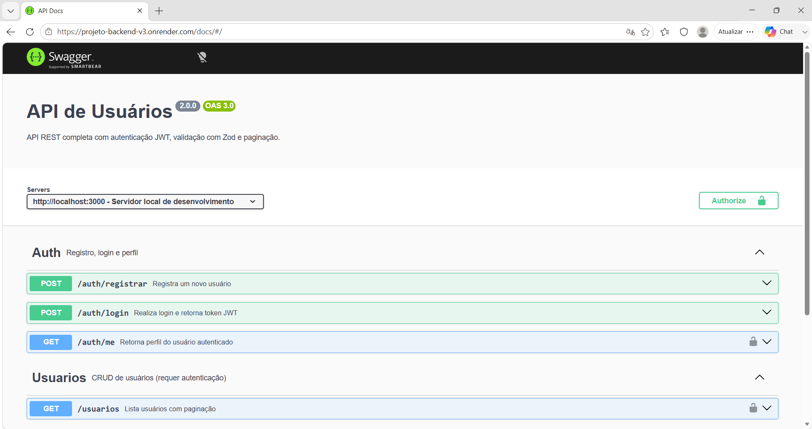
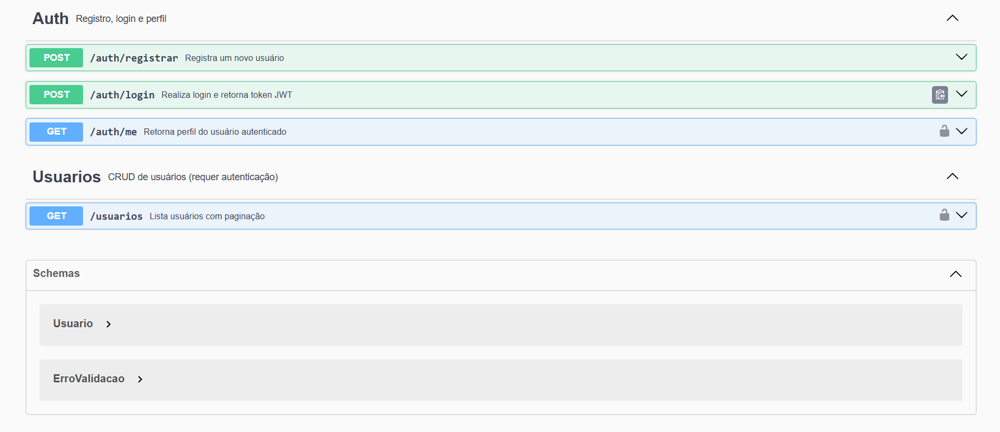
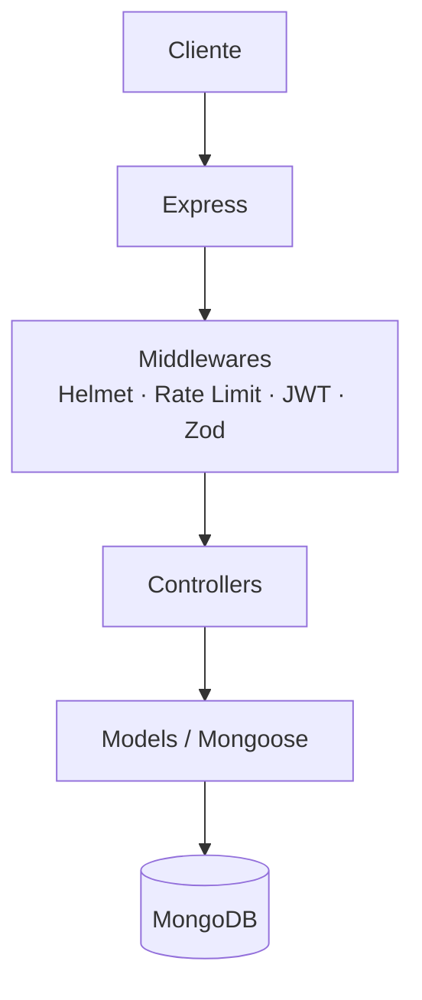

# Projeto Backend API v3


API REST para gerenciamento de usuários desenvolvida com Node.js, Express e MongoDB, aplicando boas práticas de arquitetura, autenticação, segurança, testes automatizados e containerização.

---

## Destaques

- ✅ API REST completa com CRUD de usuários
- ✅ Autenticação JWT com hash de senhas (bcryptjs)
- ✅ Docker + Docker Compose
- ✅ Swagger / OpenAPI 3.0
- ✅ GitHub Actions (CI)
- ✅ 17 testes automatizados
- ✅ Cobertura de código superior a 90%

---

## Demonstração

| | |
|---|---|
| **API Online** | https://projeto-backend-v3.onrender.com |
| **Swagger / Docs** | https://projeto-backend-v3.onrender.com/docs |
| **Pipeline CI** | [GitHub Actions](https://github.com/Algarve94/projeto-backend.v3/actions) |

---

## Documentação Swagger





---

## Objetivos do projeto

Este projeto foi desenvolvido para demonstrar conhecimentos em:

- Desenvolvimento de APIs REST
- Autenticação JWT
- Validação de dados
- Boas práticas de segurança
- Testes automatizados
- Containerização com Docker
- Documentação OpenAPI / Swagger
- Integração contínua (GitHub Actions)

---

## Tecnologias

| Camada          | Tecnologia                               |
|-----------------|------------------------------------------|
| Runtime         | Node.js `^20.x`                          |
| Framework       | Express `^5.x`                           |
| Banco de dados  | MongoDB + Mongoose                       |
| Autenticação    | JSON Web Token + bcryptjs                |
| Validação       | Zod                                      |
| Segurança       | Helmet + express-rate-limit              |
| Testes          | Jest + Supertest + mongodb-memory-server |
| Documentação    | Swagger UI / OpenAPI 3.0                 |
| Containerização | Docker + Docker Compose                  |

> As versões exatas de cada dependência estão no [`package.json`](./package.json).

---

## Funcionalidades

- Cadastro e autenticação de usuários com JWT
- Hash de senhas com bcryptjs (nunca armazena senha em texto puro)
- Validação de entrada em todas as rotas com Zod
- Paginação e filtro por nome na listagem de usuários
- Soft delete (desativação sem apagar o registro do banco)
- Rate limiting nas rotas de autenticação (proteção contra força bruta)
- Headers de segurança HTTP via Helmet
- Documentação interativa da API com Swagger
- Testes de integração com banco em memória (sem dependência externa)
- Containerização completa com Docker Compose

---

## Arquitetura



---

## Estrutura do projeto

```
projeto-backend.v3/
├── config/                  # Conexão com o MongoDB
├── controllers/             # Lógica dos endpoints
├── docs/                    # Configuração do Swagger
├── middlewares/             # Middlewares de autenticação, segurança e validação
├── models/                  # Schemas Mongoose
├── routes/                  # Rotas públicas e protegidas
├── tests/                   # Testes automatizados
├── validators/              # Schemas Zod
├── .env.example             # Exemplo de variáveis de ambiente
├── docker-compose.yml
├── Dockerfile
├── DEPLOY.md
└── server.js                # Ponto de entrada da aplicação
```

---

## Como rodar localmente

### Pré-requisitos

- Node.js 20+
- MongoDB rodando localmente ou uma URI do MongoDB Atlas

### Instalação

```bash
# Clone o repositório
git clone https://github.com/Algarve94/projeto-backend.v3.git
cd projeto-backend.v3

# Instale as dependências
npm install

# Configure as variáveis de ambiente
cp .env.example .env
```

Edite o `.env` com suas configurações:

```env
PORT=3000
MONGO_URI=mongodb://localhost:27017/exemplo_db
NODE_ENV=development
JWT_SECRET=seu_segredo_forte_aqui
JWT_EXPIRES_IN=7d
```

Gerar um `JWT_SECRET` seguro:

```bash
node -e "console.log(require('crypto').randomBytes(64).toString('hex'))"
```

Inicie o servidor em modo desenvolvimento:

```bash
npm run dev
```

Acesse a documentação em `http://localhost:3000/docs`

---

## Como rodar com Docker

```bash
# Sobe a API e o MongoDB juntos
docker compose up --build
```

Sem precisar instalar MongoDB localmente. Tudo roda dentro dos containers.

---

## Testes

```bash
# Rodar testes
npm test

# Rodar com relatório de cobertura
npm run test:coverage
```

Cobertura atual:: 25 testes aprovados com cobertura superior a 90%.

```
✔ Cobertura:
   Statements : 90%
   Functions  : 90%
   Lines      : 90%
```

Os testes usam um banco MongoDB em memória — nenhuma configuração extra é necessária.

---

## Rotas da API

### Autenticação (públicas)

| Método | Rota             | Descrição                     |
|--------|------------------|-------------------------------|
| POST   | /auth/registrar  | Cadastra novo usuário         |
| POST   | /auth/login      | Autentica e retorna token JWT |

### Usuários e perfil (requer JWT)

| Método | Rota           | Descrição                      |
|--------|----------------|--------------------------------|
| GET    | /auth/me       | Retorna perfil do usuário      |
| GET    | /usuarios      | Lista usuários com paginação   |
| GET    | /usuarios/:id  | Busca usuário por ID           |
| POST   | /usuarios      | Cria novo usuário              |
| PUT    | /usuarios/:id  | Atualiza dados do usuário      |
| DELETE | /usuarios/:id  | Desativa usuário (soft delete) |

---

## Exemplos de uso

Registrar usuário:

```bash
curl -X POST http://localhost:3000/auth/registrar \
  -H "Content-Type: application/json" \
  -d '{"nome": "João Silva", "email": "joao@email.com", "senha": "senha123"}'
```

Listar usuários autenticado:

```bash
curl http://localhost:3000/usuarios \
  -H "Authorization: Bearer <token>"
```

---

## Segurança

- Senhas armazenadas com hash bcryptjs (salt rounds: 12)
- Tokens JWT com validade configurável
- Rate limiting nas rotas de autenticação: 10 tentativas por IP a cada 15 minutos
- Rate limiting geral: 100 requisições por IP a cada 15 minutos
- Headers HTTP de segurança via Helmet
- Variáveis sensíveis isoladas em `.env` (nunca versionadas)
- Soft delete preserva integridade dos dados

---

## Deploy

Deploy realizado utilizando Render + MongoDB Atlas.

Consulte o arquivo [DEPLOY.md](./DEPLOY.md) para o guia completo de deploy no Render e Railway com MongoDB Atlas.

---

## Licença

Este projeto está sob a licença [MIT](./LICENSE).
Sinta-se livre para usar como base em seus próprios projetos.
